# Python

## 1 - Перший образ

**mytsv/python-methologies:v1**

Для того, аби в контейнер не підтягувалися нові версії залежностей, я використала утиліту pipreqs:
```bash
# З кореня репозиторію
cd ./python
pip install pipreqs
pipreqs .
mv ./requirements.txt ./requirements/lock.txt
```
Залежність uvicorn довелось додати вручну у цей список, вказавши останню версію, оскільки pipreqs не включив її автоматично.

Опис контейнера застосунку в Dockerfile:
```dockerfile
# Поки що використовуємо важкий базовий образ на основі Debian
FROM python:3.10-bullseye

# Переключаємося на роботу з цією директорією в контейнері
WORKDIR /usr/src/spaceship-app

# Встановлюємо фіксовані залежності
COPY ./requirements/lock.txt ./requirements.txt
RUN pip install --no-cache-dir -r requirements.txt

# Копіюємо код 
COPY . .

# Запускаємо веб-застосунок разом із контейнером
CMD [ "uvicorn", "spaceship.main:app", "--host=0.0.0.0", "--port=8080" ]
```

Для вимірювання часу збірки образу я використовую BuildKit, попередньо збірки присвоївши змінній середовища DOCKER_BUILDKIT значення 1. \
Для вимірювання розміру образу користуюсь виводом команди ```docker images```. Результати будуть наведені у кінці розділу для порівняння.

При запуску контейнера користуюсь прапорцем ```-p 8080```, аби прив'язати цей порт контейнера до випадкового на моїй системі. Через ```docker container ls``` взнаю цей порт на моїй системі. Результат підверджує правильну збірку образу:

<details>
  <summary>Результат підверджує правильну збірку образу:</summary>

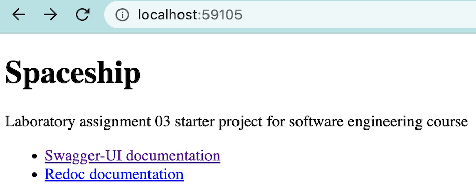
</details>

## 2 - Зміна коду

**mytsv/python-methologies:v2**

Я відредагувала build/index.html (цей файл ігнорується системою контролю версій) наступним чином:
```html
<p>Laboratory assignment 03, <i>finished by Victoria Myts</i></p>
```

<details>
  <summary>Після збірки образу й запуску контейнера, результат:</summary>

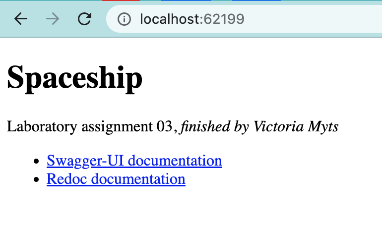
</details>

## 3 - Менш ефективний Dockerfile

**mytsv/python-methologies:v2-imperfect**

Оскільки спершу порядок команд був ідеальним, у новому Dockerfile я змінила їх місцями:

```dockerfile
COPY . .

RUN pip install --no-cache-dir -r ./requirements/lock.txt
```

## 4 - Легший базовий образ

**mytsv/python-methologies:v2-light**

Змінено перший рядок Dockerfile:
```dockerfile
FROM python:3.10-slim
```

Спершу я випробувала тег 3.10-alpine3.16, але з ним виникали проблеми в наступному пункті при встановленні залежності numpy. Не вистачало певних системних залежностей, тому я переробила цей пункт, використовуючи трішки об'ємніший, але працюючий базовий образ.

## 5 - Нові залежності

**mytsv/python-methologies:v3**

У spaceship/routers/api.py доданий новий ендпоінт /product:
```python
@router.get('/product')
def matrix_product() -> dict:
    import numpy as np

    # Create two 10x10 random matrices
    matrix_a = np.random.rand(10, 10)
    matrix_b = np.random.rand(10, 10)

    # Multiply the matrices together
    result = np.dot(matrix_a, matrix_b)

    return {
        'matrix_a': matrix_a.tolist(), 
        'matrix_b': matrix_b.tolist(), 
        'product': result.tolist()
    }
```

Через pipreqs було оновлено файл зі списком фіксованих залежностей, але версія numpy на моєму пристрої виявилась без підтримки python 3.10, тому я замінила її вручну на новішу.

<details>
  <summary>Результат запуску:</summary>

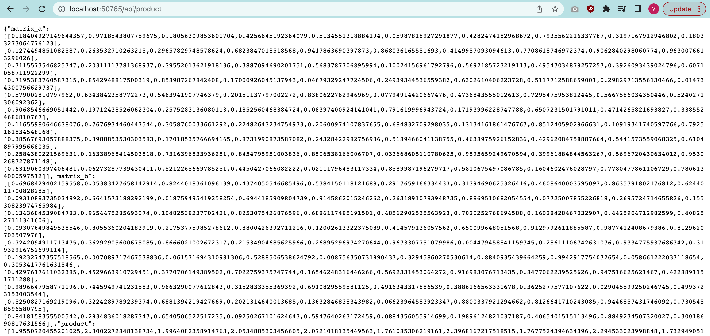
</details>

Згодом був створений ще один образ **mytsv/python-methologies:v3-heavy** на основі базового з тегом 3.10-bullseye.

## Виміри й порівняння

<details>
  <summary>Знімки екрану з результатом запуску команд виміру</summary>

  ### Час збірки

  Пункт 1

  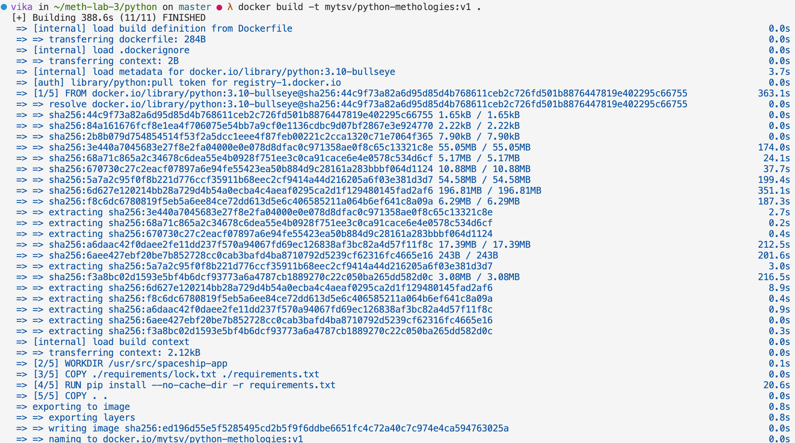

  Пункт 2

  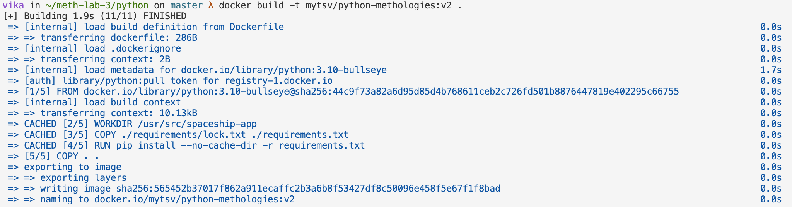

  Пункт 3

  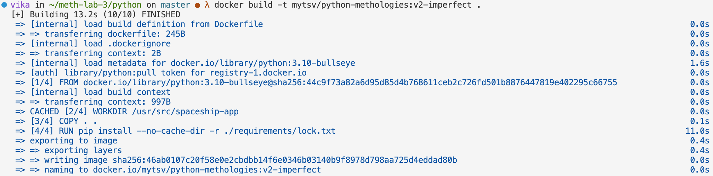

  Пункт 4

  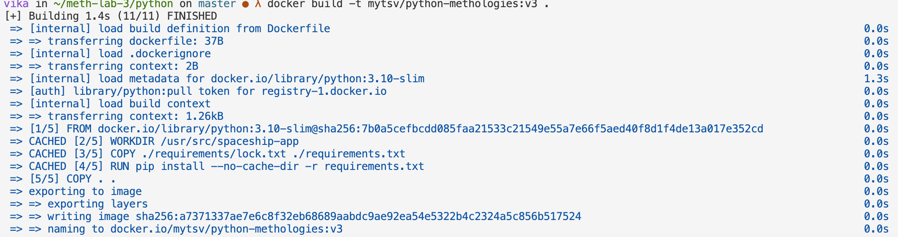

  Пункт 5 - slim

  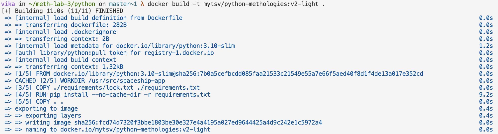

  Пункт 5 - bullseye

  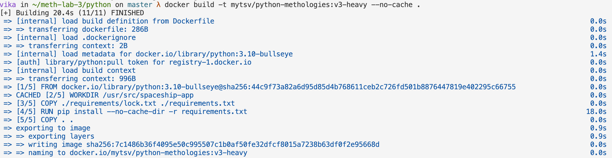

  ### Розмір образу

  Червоним виділено образ, який створювався з базового python:3.10-alpine3.16

  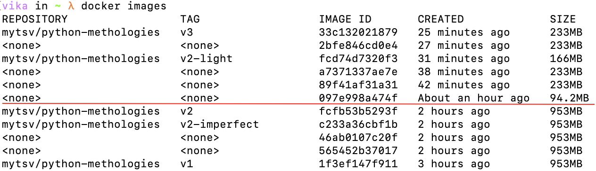

  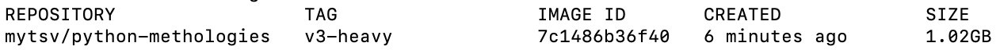

</details>

### Час збірки

З декількох запусків команди ```docker build``` мені стало зрозуміло, що час збірки залежить від багатьох змінних, і не кожна пов'язана з маніпуляціями, проведеними з програмним кодом чи Dockerfile. Оскільки залежності завантажуються, то за кращого у період часу інтернет-з'єдання важкий базовий образ може завантажитися швидше, ніж легший. При більш-менш однакових параметрах мережі, очевидно, швидше проходила збірка образів з меншими базовими образами (**1 пункт** довше за **4 пункт**) або з легшими залежностями (**5 пункт** довше за **4 пункт**).\
Завдяки уже завантаженим базовим образам і кешуванню шарів, на 2+ запуску збірки (без змін файлів проєкту) швидкість значно збільшувалась. (**1 пункт** довше за **2 пункт**).\
Між **2 і 3 пунктом** я побачила різницю лише у тому, що за зміни порядку команд (і разом з цим шарів) кешування спершу не спрацювало. Після цього я експерементувала зі збіркою, у тому числі застосовуючи прапорець ```--no-cache```. Проте, ніякої "статистичної" відмінності між часом збірки неідеального та оптимізованого порядку шарів я не помітила.

### Розмір образу

Для зручного аналізу створю таблицю:

| Тег/Опис | Розмір |
| ------------- | ------------- |
| v1 | 953MB  |
| v2  | 953MB  |
| v2-imperfect  | 953MB  |
| v2-light  | 166MB  |
| v3  | 233MB  |
| v3-heavy | 1.02GB  |
| База alpine | 94.2MB |

З цього можна зробити висновок, що на розмір образу впливає вибір базового образу (**alpine** < **v2-light** < **v1**) і кількість та важкість залежностей (**v2-light** < **v3**; **v2** < **v3-heavy**).\
Для пунктів 2 і 3 у цьому вимірі також майже не виявилось різниці. Я вирішила взнати більш точний розмір обох образів:

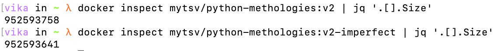

Виходить, що "ідеальний" важить навіть на декілька байтів більше! Схоже на те, що причиною цього є додатковий файл із списком залежностей.

## Висновок

З проведених експериментів я можу виділити такі рекомендації:
- Для того, аби уникнути неочікуваних проблем через підтягування нових версій залежностей у контейнери, можна використовувати різноманітні засоби закріплення залежностей. Для Python проєктів були перевірені утиліти pip freeze і pipreqs.
- Аби зберегти пам'ять пристрою, на якому здійснюється контейнеризація, можна використати більш легку базу образу. Проте, потрібно бути обережним: деякі базові образи при незначному виграші в розмірі викличуть немало важких для виправлення проблем. При пошуку рішень, помилка завантаження деяких залежностей Python на Alpine Linux образ виявилась не унікальною для мене.
- Я не побачила значущої різниці між вимірами ефективності образу з оптимізованим і неоптимізованим порядком шарів. Підозра падає на недостатньо великий розмір моїх Dockerfile'ів. Проте,я вважаю, що ефективним порядком команд усе одно не треба нехтувати.
- Оскільки розмір залежностей значно впливає на розмір образу, іноді варто обирати більш lightweight опції, якщо це важливо в зв'язку зі специфіками пристроїв (як от в IoT). Наприклад, uvicorn[standard] замість uvicorn, або ж я скористатись tinynumpy замість numpy.